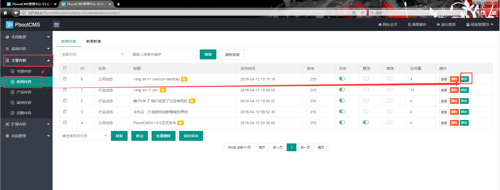
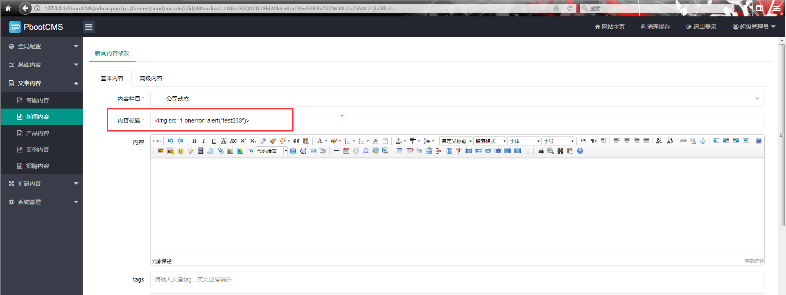
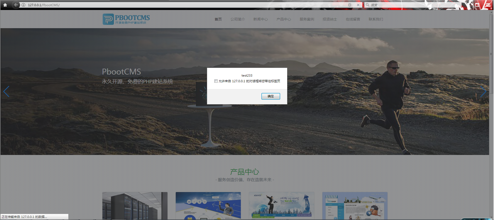

## PbootCMS v2.0.2 storage xss ##
This version cms have a storage xss in administrator page, but it was htmlentities in Background page, howerver, they didn’t think about front page like index.php, so we can write the poc in administrator page and get user or administrator cookie.
First click the news editor page, then editor news title and write xss poc, and the index.php will be effect :

