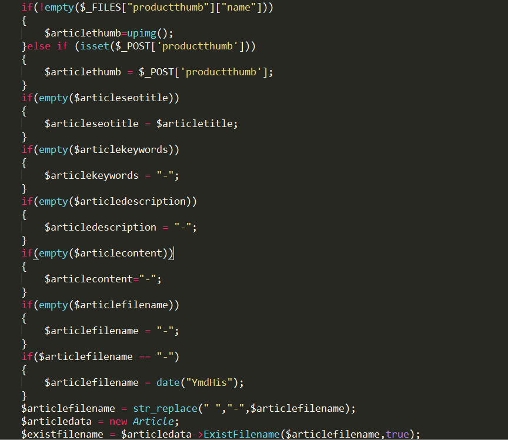
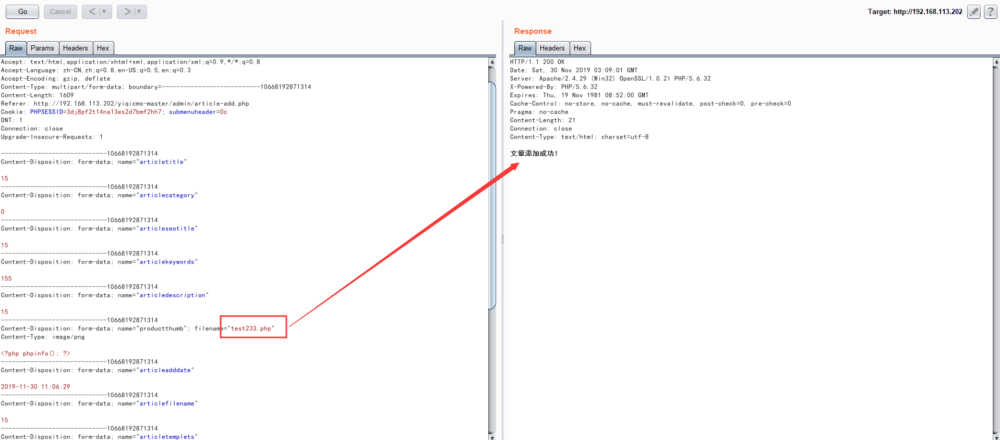
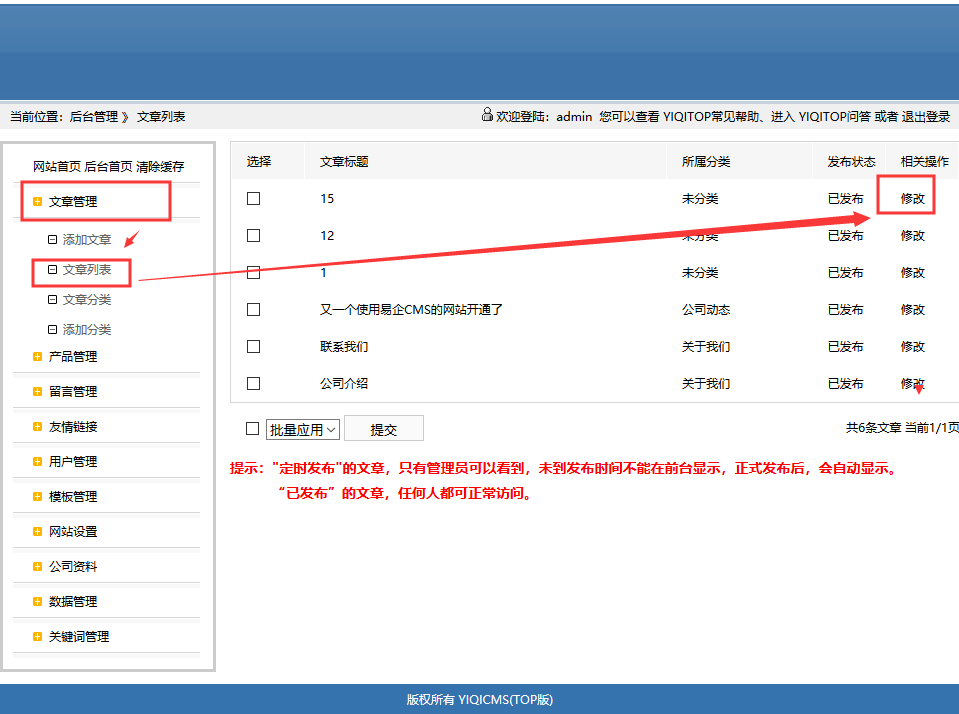
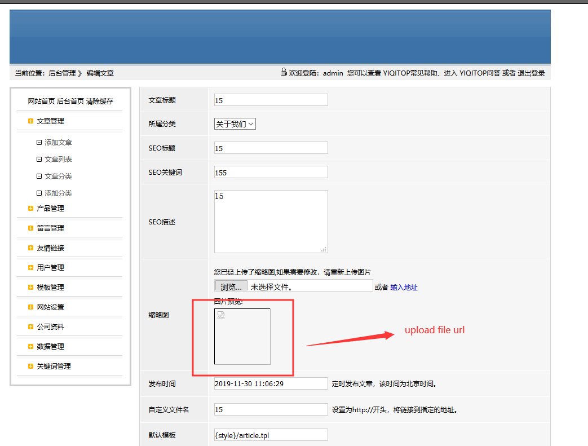
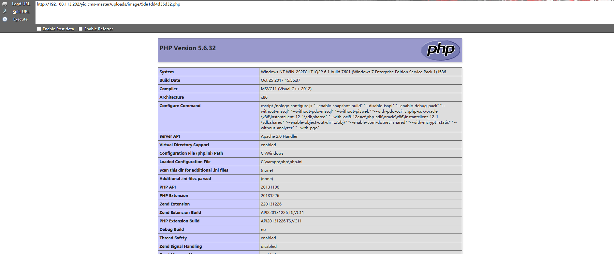

## YiqiCMS background file-upload getshell ##
In The Lastest Version,YiqiCMS allow upload picture,but it check file only in js code,we can get the shell easy. At file \admin\article-add.php:

Program only check the file if exist and check the ext with javascript, we can upload file with this paylad:

We can find our upload file url in article editor page:

And we can get our upload file:

